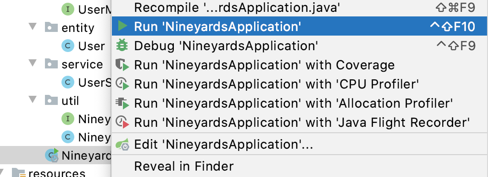

# NineYards

## Background
Project Management software

## Technology selection
- JDK 11

- SpringBoot 2.5.4
    - SpringMVC
    - Thymeleaf 
   
- MySQL 8.0.21

## Package structure 
   

## Getting start
1. Load Project.
2. Install MySQL 8.0.21.
3. Run schema_ddl.sql in MySQL to create database and schema.
4. Build before run (make sure you get all .jar)
    - mvn clean install -Dmaven.test.skip=true 
    
5. Run the main method:
   

